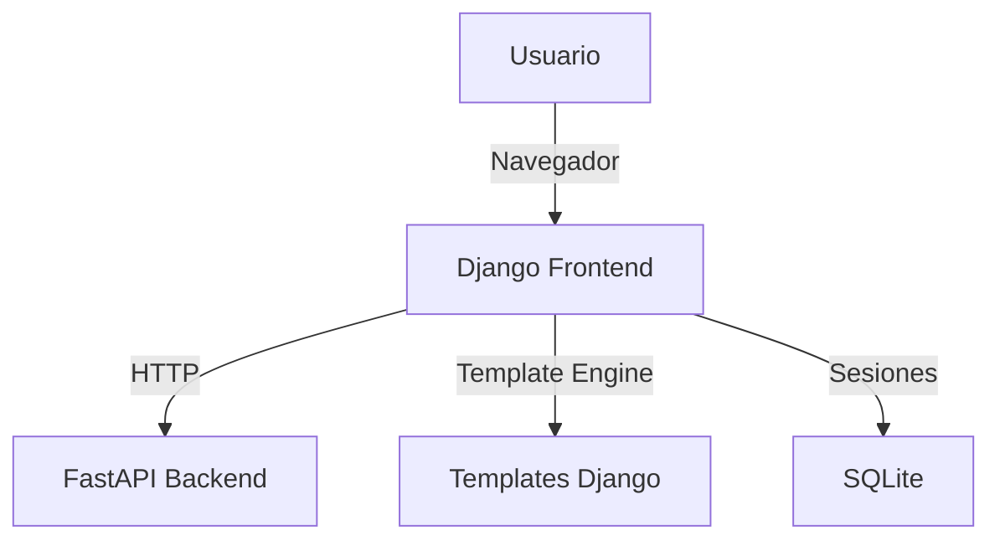
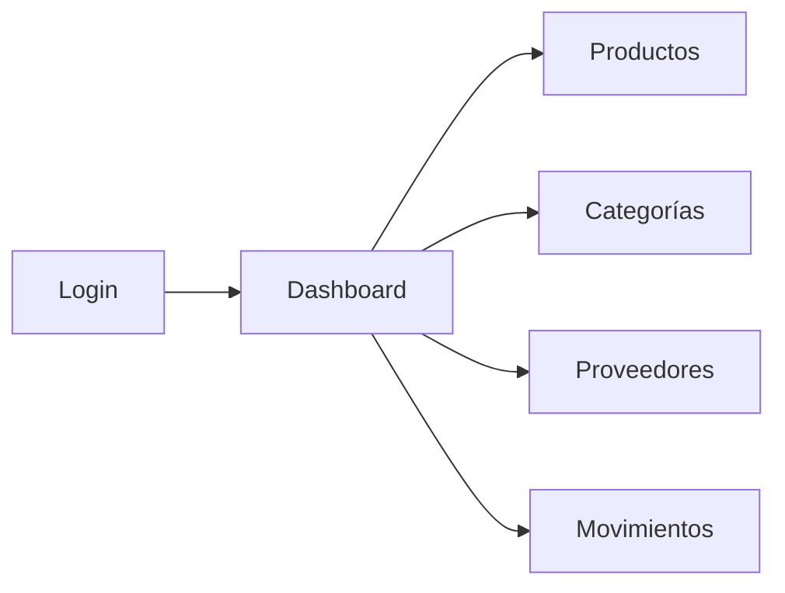

[](https://deepwiki.com/RomanOsma/scl_frontend_django)

# SCL Inventory - Frontend (Django)

[Ver Documentación Completa](https://deepwiki.com/RomanOsma/scl_frontend_django)

## 📋 Descripción del Proyecto

Frontend desarrollado con Django para interactuar con el sistema de gestión de inventario SCL. Este proyecto consume la API proporcionada por el backend `scl_backend_fastapi`.

### Tecnologías Principales
- 
- 
- 
- 

### Arquitectura del Sistema


## 🚀 Características Principales

- ✨ Interfaz de usuario moderna y responsiva
- 🔐 Autenticación integrada con backend
- 📦 Gestión de productos y categorías
- 🏢 Administración de proveedores
- 📊 Visualización de movimientos de inventario
- 🎨 Diseño con Bootstrap 5
- 📱 Diseño responsive

## 🔄 Integración con Backend

Este frontend se integra con el [Backend FastAPI](https://github.com/RomanOsma/scl_backend_fastapi) a través de su API REST. Es necesario tener el backend configurado y ejecutándose antes de usar el frontend.

## 📱 Vistas Principales

### Portal de Inventario


### Características de la Interfaz
- 📊 Dashboard con resumen de inventario
- 📦 Gestión de productos con imágenes
- 📋 Listados con paginación y búsqueda
- 📈 Gráficos de movimientos
- 🔍 Filtros avanzados

## 🚀 URL's Principales

- `/portal/login/` - Inicio de sesión
- `/portal/dashboard/` - Panel principal
- `/portal/productos/` - Gestión de productos
- `/portal/categorias/` - Gestión de categorías
- `/portal/proveedores/` - Gestión de proveedores
- `/portal/movimientos/` - Registro de movimientos

## 📚 Documentación Adicional

Para una documentación más detallada, incluyendo:
- Guías de uso
- Capturas de pantalla
- Flujos de trabajo
- Ejemplos de integración

Visita nuestra [Wiki completa en DeepWiki](https://deepwiki.com/RomanOsma/scl_frontend_django)

## 🔗 Proyectos Relacionados

- [Backend FastAPI](https://github.com/RomanOsma/scl_backend_fastapi) - API REST del sistema
- [Documentación Backend](https://deepwiki.com/RomanOsma/scl_backend_fastapi) - Wiki del backend

## 🤝 Contribución

Si deseas contribuir al proyecto, por favor:
1. Haz fork del repositorio
2. Crea una rama para tu feature (`git checkout -b feature/AmazingFeature`)
3. Commit tus cambios (`git commit -m 'Add some AmazingFeature'`)
4. Push a la rama (`git push origin feature/AmazingFeature`)
5. Abre un Pull Request

## 📝 Licencia

Este proyecto está licenciado bajo la Licencia MIT - ver el archivo [LICENSE](LICENSE) para más detalles.

## Ejecución Local

### Prerrequisitos
*   Python 3.10 o superior
*   pip (gestor de paquetes de Python)
*   Git
*   El **Backend FastAPI (`scl_backend_fastapi`) debe estar configurado y ejecutándose** (normalmente en `http://127.0.0.1:8000`).

### Pasos

1.  **Clonar el Repositorio:**
    ```bash
    git clone https://github.com/RomanOsma/scl_frontend_django.git
    cd scl_frontend_django
    ```

2.  **Crear y Activar Entorno Virtual:**
    ```bash
    python -m venv venv
    ```
    Activación:
    *   Windows (CMD): `venv\Scripts\activate.bat`
    *   Windows (PowerShell): `venv\Scripts\Activate.ps1` (puede requerir cambiar la política de ejecución: `Set-ExecutionPolicy Unrestricted -Scope Process`)
    *   macOS/Linux (bash/zsh): `source venv/bin/activate`

3.  **Instalar Dependencias:**
    Con el entorno virtual activado:
    ```bash
    pip install -r requirements.txt
    ```

4.  **Configurar Variables de Entorno:**
    *   Crea un archivo llamado `.env` en la raíz del proyecto (`scl_frontend_django/.env`).
    *   Añade el siguiente contenido:
        ```env
        # scl_frontend_django/.env

        # URL base de tu backend FastAPI local (asegúrate de que el puerto y prefijo /api/v1 sean correctos)
        FASTAPI_BASE_URL=http://127.0.0.1:8000/api/v1

        # Variables para la configuración de Django en desarrollo local
        DJANGO_SECRET_KEY_LOCAL=una_clave_secreta_simple_y_diferente_para_frontend_local
        DJANGO_DEBUG_LOCAL=True
        DJANGO_ALLOWED_HOSTS_LOCAL=127.0.0.1,localhost
        ```
    *   **Importante:** `FASTAPI_BASE_URL` debe apuntar a donde está corriendo tu backend FastAPI local.

5.  **(Opcional pero Recomendado) Aplicar Migraciones de Django:**
    Django usa la base de datos para sesiones, admin, etc.
    ```bash
    python manage.py migrate
    ```

6.  **Ejecutar el Servidor de Desarrollo Django:**
    ```bash
    python manage.py runserver 8001
    ```

7.  **Acceder a la Aplicación:**
    *   Abre tu navegador y ve a: `http://127.0.0.1:8001/`
    *   Deberías ser redirigido a la página de login: `http://127.0.0.1:8001/portal/login/`.
    *   Asegúrate de usar **HTTP** y no HTTPS para el servidor de desarrollo local.
